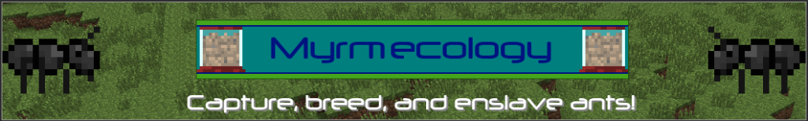

# myrmecology3

[

This project uses
* [Minecraft forge versioning](https://mcforge.readthedocs.io/en/latest/conventions/versioning/)
* [GitFlow](https://www.atlassian.com/git/tutorials/comparing-workflows/gitflow-workflow)

The 0.0.1-beta release is pending

## Issue graph

## Labels
* **feature**: An idea whose implementation has been agreed upon and that does not build upon an existing feature.
* **help wanted**: The assignee is unable to tend to this issue on their own or help from the community is desired.
* **high priority**: This issue is critical for the entire project or a certain milestone.
* **medium priority**: Is not critical but may be a pre-requisite for other medium or low priority issues. Should be tended to after high priority issues.
* **low priority**: Not important and should be tended to after medium priority issues.
* **idea**: Has not been discussed as a potential feature or a conclusion has not been reached about its validity and worth to the project.
* **improvement**: An improvement to an exisitng feature and one that does not introduce new features.
* **in progress** (Waffle.io): The issue is currently being tended to/implemented.
* **ready** (Waffle.io): The issue is ready to be tended to.
* **invalid**: Not appropriate for the project or rejected.
* **question**: A question and not necessarily an issue representing something to be implemented or changed.
* **duplicate**: A duplicate of an existing (closed or open) issue.

Note all issues assigned to a certain milestone should be completed before that milestone is regarded as being reached.
An issue's prerequisite steps must be completed first.
